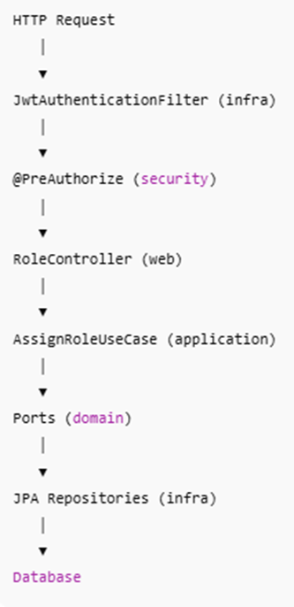
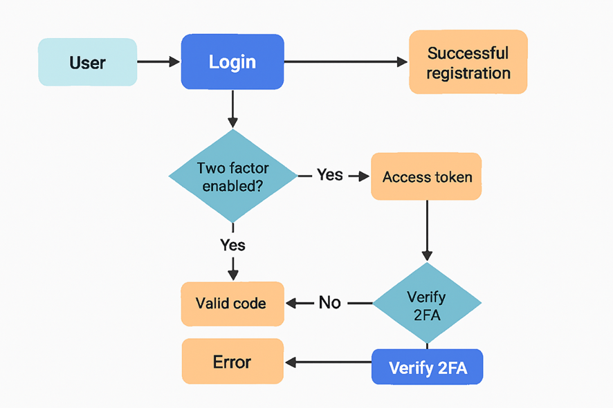

# **Arquitectura Limpia** 
  

## **¿Qué significa Request?**

Se usa para entradas que vienen desde el cliente (frontend, API REST, etc.).
Representa los datos que el usuario envía al backend.
Ejemplos:

•	LoginRequest: contiene username y password.

•	RegisterRequest: contiene los datos para crear un usuario.

•	ForgotPasswordRequest: contiene el email para iniciar recuperación.

## **¿Qué significa Response?**

Se usa para salidas que el backend devuelve al cliente.
Representa los datos que el backend responde después de procesar una acción.
Ejemplos:

•	AuthResponse: contiene el token, userId, etc.

•	RegisterResponse: contiene el userId y confirmación del registro.

•	TokenResponse: contiene el nuevo accessToken y refreshToken.

## ¿Qué es un Use Case?

Un Use Case representa una acción del negocio que el sistema puede ejecutar.
Un Use Case orquesta el flujo, pero no implementa detalles técnicos.
**Regla de oro para tus Use Cases**

Un Use Case correcto:

•	Tiene un nombre que expresa intención

•	No depende de frameworks

•	No accede directamente a DB

•	No conoce HTTP, REST, JSON

•	Tiene una sola responsabilidad

### Flujo completo de doble autenticación

#### Registro (/auth/register) ejemplo: http://localhost:9090/api/auth/register

 
El usuario se crea en la base (users), con sus credenciales y la bandera twoFactor = true.
Si twoFactor = false, el login será directo.
Si twoFactor = true, el login requerirá un paso adicional.

#### Login (/auth/login) ejemplo: http://localhost:9090/api/auth/login

 
El sistema valida username + password.
Si el usuario no tiene 2FA, devuelve directamente el Access Token (JWT).
Si el usuario sí tiene 2FA, devuelve una respuesta indicando que se requiere verificación (ej. "twoFactorRequired": true) y envía el código temporal por email.

#### Verificación 2FA (/auth/verify-2fa) ejemplo: http://localhost:9090/auth/verify-2fa

El usuario envía el username y el code recibido.
El sistema valida que el código coincida y no esté expirado.
Si es correcto, devuelve el Access Token (JWT).
Si es incorrecto o expirado, devuelve error.

#### Olvidó Contraseña (/auth/forgot-password) ejemplo: http://localhost:9090/api/auth/forgot-password

El usuario envía solamente el correo
Le llega un correo con instrucciones y el link para configurarlo al front
Donde por medio de la url llega el token generado

#### Reseteo de Contraseña (/auth/reset-password) ejemplo: http://localhost:9090/api/auth/reset-password

Con el token generado en el correo mas la nueva contraseña se actualizará en la base de datos validado que este entre el doble factor para que la próxima vez sea obligatorio mientras no se olvide la contraseña y no la active manualmente el usuario podrá registra sin doble factor y tocará en futuro recordarle que debe validar doble factor.

Uso del Access Token 
El cliente incluye el JWT en el Authorization: Bearer <token> en cada request.
Los endpoints protegidos validan el token y permiten acceso.

**Proceso completo**
•	El usuario autentica y recibe el toke si es valido el usuario

•	El cliente solicita autorización: Cuando se empiece con microfrontends.

•	El authorization_code enlaza ambos para que luego el cliente pueda pedir el Access Token.

Así el IdP no solo valida usuarios, sino también controla qué aplicaciones (clientes) pueden actuar en nombre de ellos a futuro porque el plan es migrar en primera instancia la autenticación y mantener el proyecto core en php hasta ir migrando cada módulo independientemente.
